# TalentSol — AI-Powered Applicant Tracking System

A MVP production-ready SaaS applicant tracking system with real JWT authentication, multi-tenant data isolation, Stripe subscription billing, and an integrated XGBoost ML model for automated candidate screening.

---

## Recent Update — UI Overhaul & SaaS Productization with Claude Code

I recently experimented with Anthropic's [Claude Code](https://docs.anthropic.com/en/docs/claude-code) terminal interface to direct a comprehensive UI overhaul and SaaS productization of my hobbyist TalentSol applicant tracking system application. Claude Code has emerged as one of the most discussed AI development tools in the industry. I wanted to evaluate its capabilities firsthand through a substantive, multi-phase project rather than isolated prompts. For full project context, including the original frontend build with [Augment Code](https://www.augmentcode.com/) Agent, see my earlier articles in this series.

My role throughout the user interface (UI) overhaul was **product owner, context engineer and system designer**, with Claude Code serving as pair programmer. Before any code generation began, I defined the overhaul objectives, UI guidelines, product requirements, architectural selection/preferences, and system design fundamentals. I maintained persistent project guidelines that served as behavioral scaffolding for Claude Code across sessions. The UI overhaul and rebuild of dependencies spanned **125 tasks across 24 phases, completed in three days**. The depth of technical preparation — from defining the system architecture and data schema upfront to maintaining structured guidelines across sessions — compressed what would otherwise require significantly longer development cycles. I completed this work on Anthropic's Claude Pro subscription tier, which imposes daily rate limits on usage. Anthropic's Claude Max tier would reduce these constraints for practitioners who require higher throughput.

### Workflow

The overhaul followed a structured but adaptive workflow:

- **UI and frontend implementation** — I directed and reviewed all interface changes that Claude Code generated against my architectural vision and product requirements.
- **Backlog documentation** — After each phase, I updated a dedicated overhaul document with full details of completed tasks to maintain a traceable record of progress.
- **Quality assurance and context management** — Between each major phase, I ran multiple test types, updated error handling, refined the project guidelines as harnesses, and compacted context to maintain Claude Code's coherence for the next phase.
- **Replanning** — I built a new plan for each subsequent phase based on test results and remaining objectives.
- **Unified data schema with synthetic data generation** — I directed the data layer redesign with seeded synthetic data to ensure reproducibility across development environments.
- **Business logic, functions, webhooks and other dependencies** — I reviewed and approved updates to application business logic, backend functions, and webhook handlers that Claude Code proposed against my system design.
- **Final refactoring** — I directed the cleanup pass to remove redundant scripts and consolidate the codebase.

Even though I am Agile Scrum certified, my workflow did not follow traditional Waterfall or Agile Scrum methodologies. The speed and flexibility of working with Claude Code enabled a tighter iteration loop than conventional sprint cycles would permit. Each phase concluded with a quality gate before replanning, creating a pragmatic cycle of **plan → implement → test → replan** that adapted organically to the project's needs.

### XGBoost Integration

The TalentSol application now integrates the best-performing XGBoost model from my prior model building projects (16+ models) into a MVP production-ready interface with a comprehensive machine learning data pipeline. The adversarial robustness considerations explored in this article apply directly to any production AI system, including applicant tracking system applications that process external candidate data from sources the organization does not control.

### Related Repositories

- [TalentSol Applicant Tracking System Application](https://github.com/youshen-lim/TalentSol---Applicant-Tracking-System-Application) — this repository
- [TalentSol Supervised Classifier for Initial Candidate Screening with Decision Trees](https://github.com/youshen-lim/TalentSol_Supervised-Classifier-for-Initial-Candidate-Screening-Decision-Trees)
- [TalentSol Supervised Classifier for Initial Candidate Screening with Regression](https://github.com/youshen-lim/TalentSol-ATS-Supervised-Classifier-for-Initial-Candidate-Screening-and-Prioritization-Regression)

---

## Features

### Core ATS
- **Jobs** — create, edit, publish job listings with department, salary, requirements, and pipeline tracking
- **Candidates** — kanban pipeline view (Applied → Screening → Interview → Offer → Hired), candidate profiles with scoring
- **Applications** — full application management with stage progression and status history
- **Interviews** — schedule and track interviews with calendar view, interviewers, and feedback
- **Analytics** — source effectiveness, pipeline metrics, time-to-hire, custom reports with recharts visualisations
- **Documents** — document management and candidate file tracking

### SaaS Infrastructure
- **Authentication** — JWT-based login/register, email verification stubs, team invite flow
- **Multi-tenancy** — row-level `companyId` isolation across all data models; all endpoints scoped per organisation
- **Subscription billing** — Stripe Checkout + Customer Portal; webhook-driven plan updates
- **Plan enforcement** — per-plan job and user limits enforced server-side across Trial, Starter, Growth, and Enterprise tiers

### AI / ML
- **XGBoost candidate screening** — integrated `best_performing_model_pipeline.joblib` with 70% recall / 57% precision at threshold 0.5027
- **Feature engineering** — HashingVectorizer + One-Hot Encoding matching the training pipeline
- **Real-time predictions** — inference results delivered via WebSocket (Socket.io)
- **Batch processing** — async scoring with retry logic and comprehensive error handling

---

## Screenshots

| | |
|---|---|
| 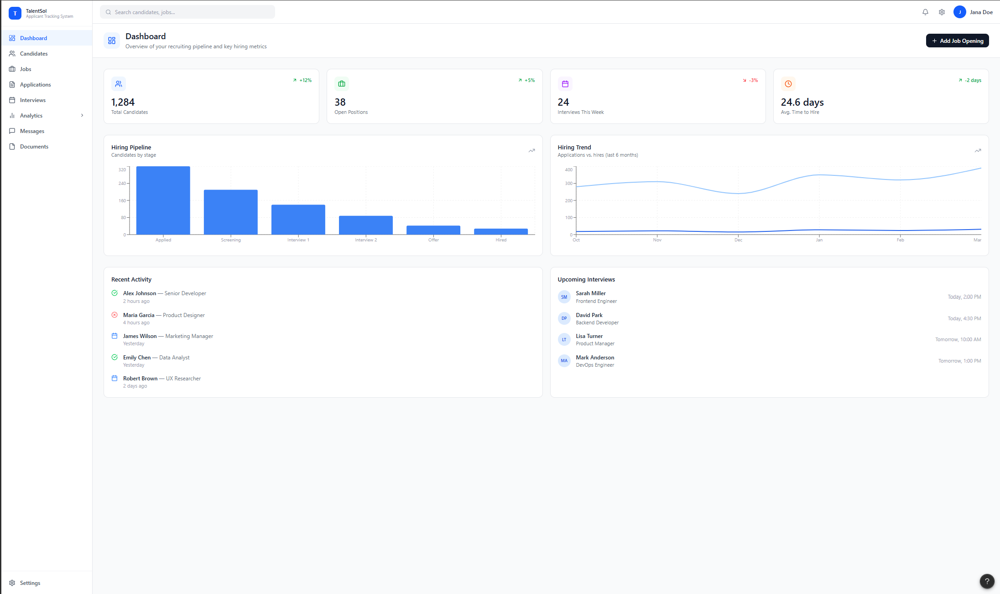 | 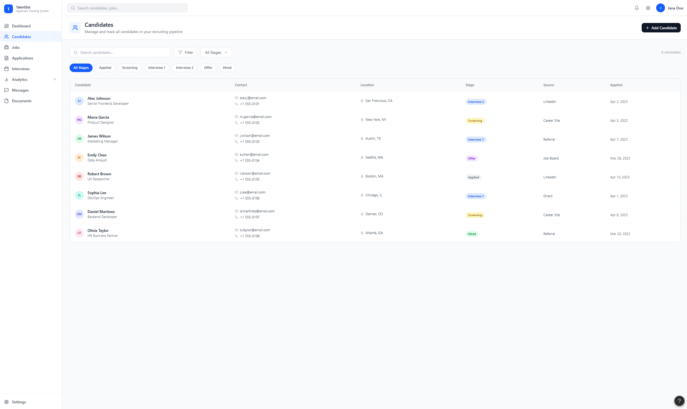 |
| **Dashboard** — pipeline stats, hiring trend, upcoming interviews | **Candidates** — stage pipeline with filters and scoring |
| 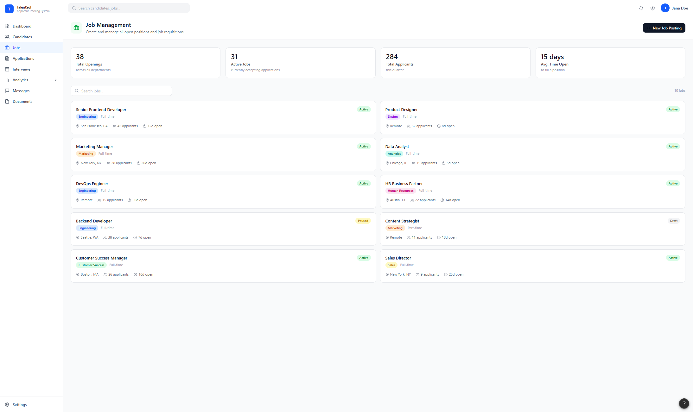 | 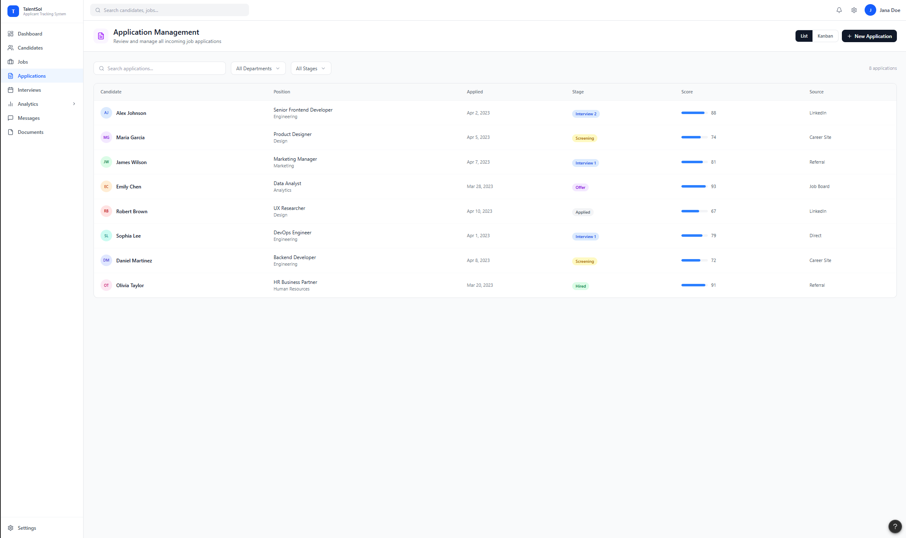 |
| **Jobs** — job listings with applicant counts and status | **Applications** — application management with ML scores |
| 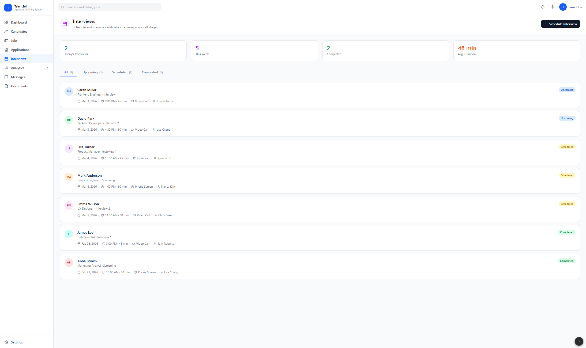 | 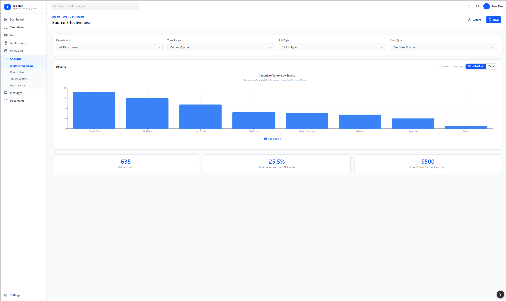 |
| **Interviews** — schedule and track across all stages | **Analytics** — source effectiveness by candidate volume |
| 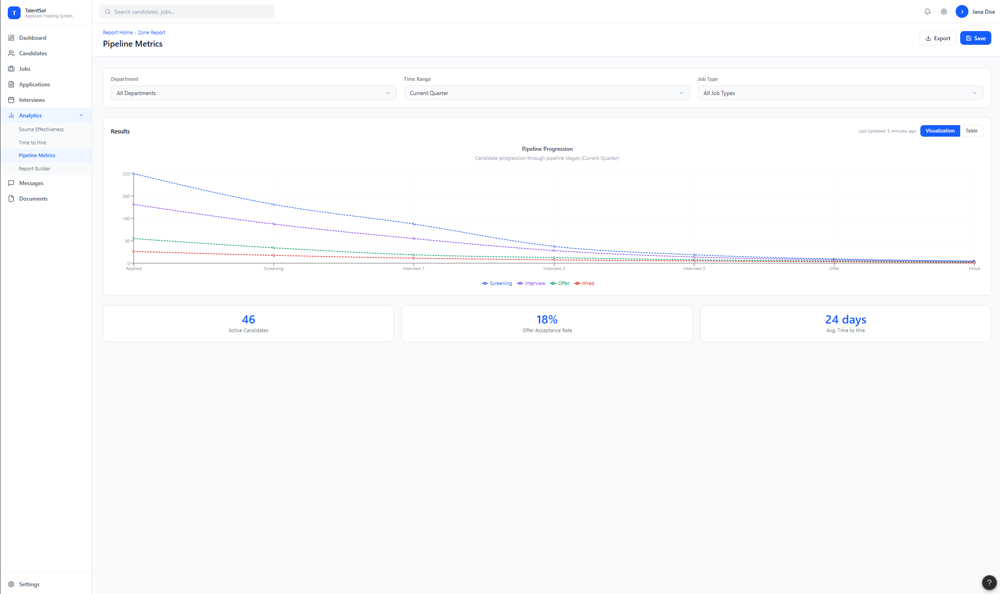 | 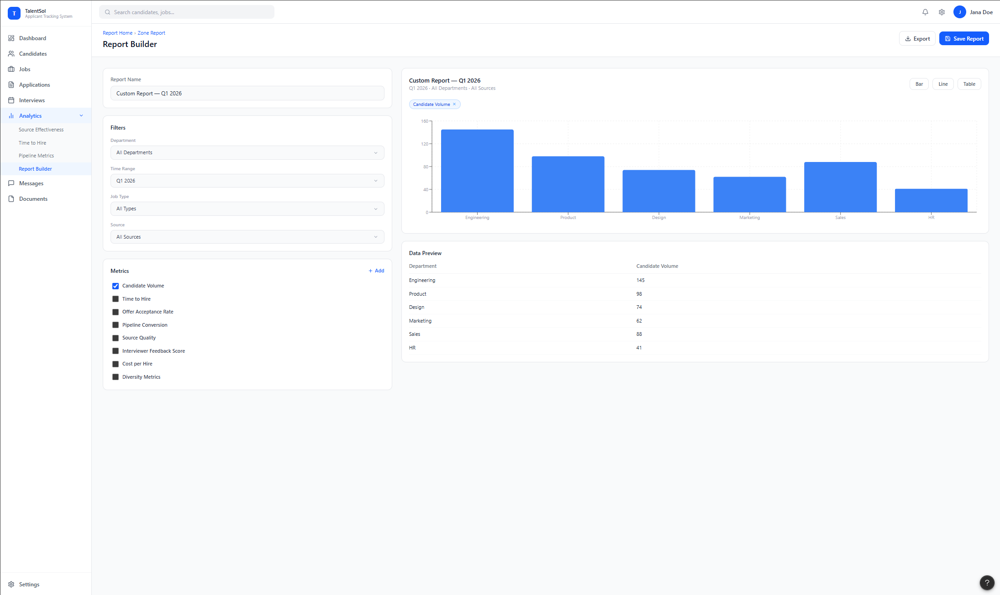 |
| **Analytics** — pipeline progression chart | **Analytics** — custom report builder |
| 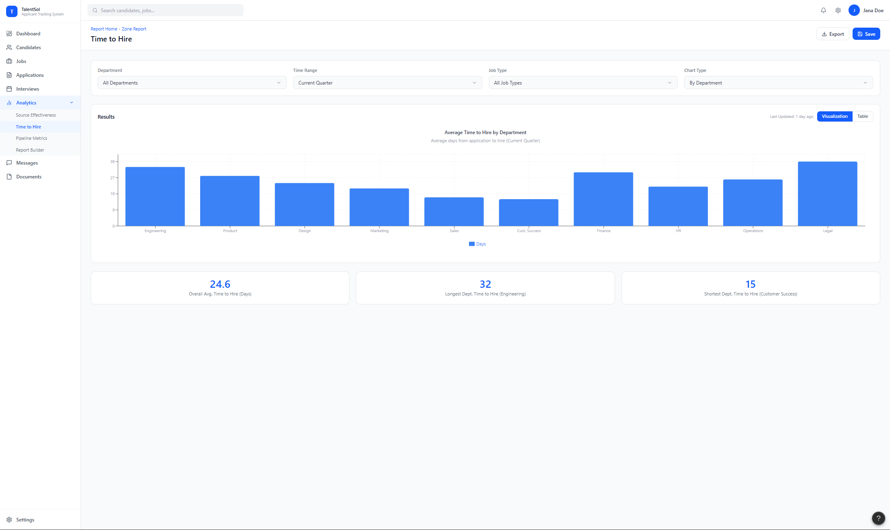 | 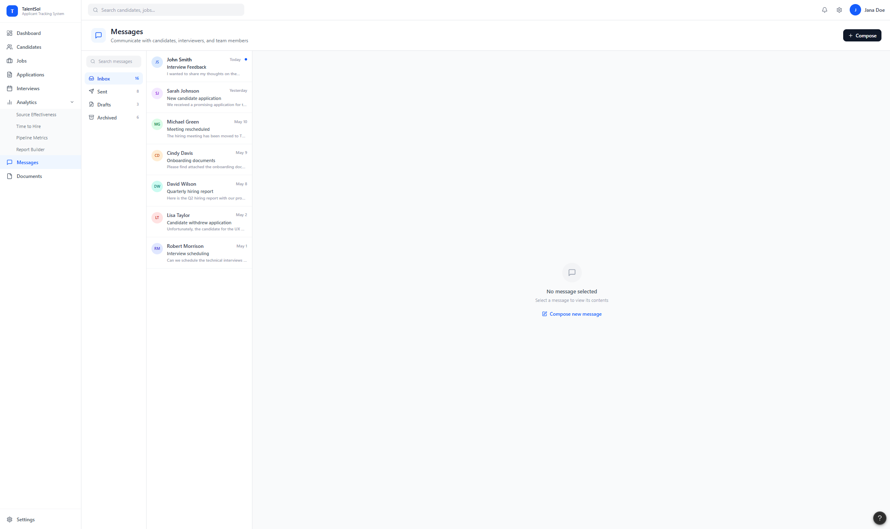 |
| **Analytics** — time to hire by department | **Messages** — team and candidate communication |
| 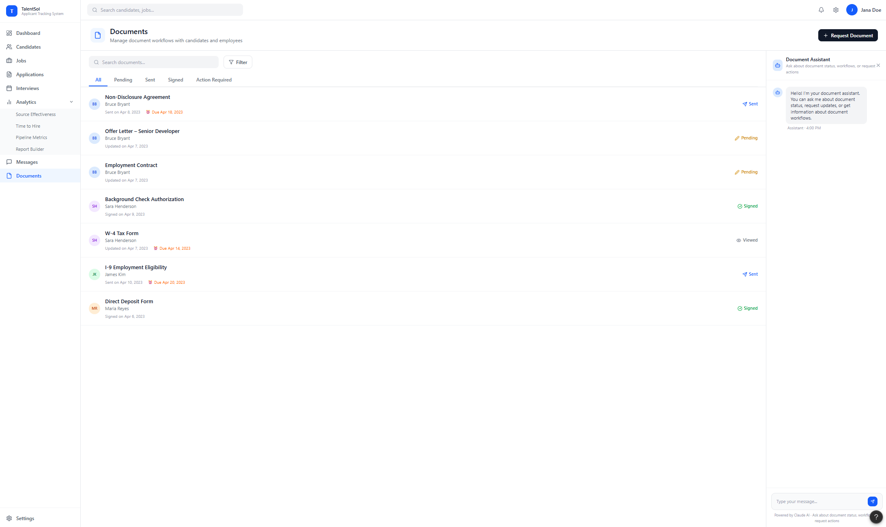 | 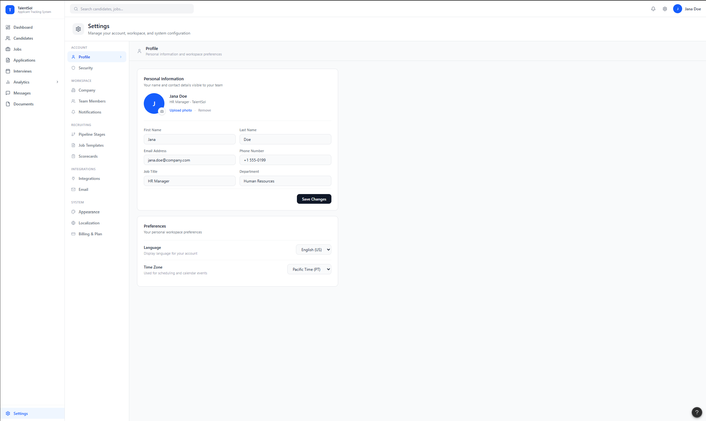 |
| **Documents** — document workflows with AI assistant | **Settings** — profile and workspace configuration |

---

## Tech Stack

| Layer | Technology |
|-------|------------|
| Frontend | React 18 + TypeScript + Vite + Tailwind CSS v4 |
| State | Zustand v5 + TanStack Query v5 |
| UI | shadcn/ui + Radix UI + Lucide icons + Recharts |
| Backend | Node.js 20 + Express + TypeScript (ESM) |
| ORM | Prisma 5.7.1 |
| Database | PostgreSQL 14+ |
| Auth | JWT (jsonwebtoken + bcryptjs) |
| Billing | Stripe (subscriptions + webhooks) |
| ML | Python 3.9+ · scikit-learn 1.6.1 · joblib 1.3.2 · XGBoost |
| Real-time | Socket.io (WebSocket, port 9001) |
| Cache | Redis (optional) · in-memory fallback |

---

## Project Structure

```
TalentSol/
├── src/                        # Frontend (React + Vite)
│   ├── pages/                  # Route-level page components
│   ├── components/             # Shared UI components
│   ├── hooks/                  # Data-fetching hooks (TanStack Query)
│   ├── services/               # API client (api.ts)
│   └── store/                  # Zustand state slices
├── backend/
│   ├── src/
│   │   ├── routes/             # Express route handlers
│   │   ├── middleware/         # Auth, plan enforcement, tenancy, rate limiting
│   │   ├── services/           # Business logic + ML integration
│   │   ├── cache/              # Redis + in-memory cache strategies
│   │   └── websocket/          # Socket.io server
│   ├── prisma/
│   │   └── schema.prisma       # Database schema (702 lines)
│   └── ml-models/              # XGBoost model + Python wrapper
├── public/                     # Static assets
└── docs/                       # Additional documentation
```

---

## Quick Start

### Prerequisites
- Node.js 20+
- PostgreSQL 14+
- Python 3.9+ with pip (for ML features)

### 1. Clone and install

```bash
git clone https://github.com/youshen-lim/TalentSol---Applicant-Tracking-System-Application.git
cd TalentSol---Applicant-Tracking-System-Application

# Frontend dependencies
npm install

# Backend dependencies
cd backend && npm install && cd ..
```

### 2. Configure environment

```bash
cp backend/.env.example backend/.env
# Edit backend/.env — set DATABASE_URL and JWT_SECRET at minimum
```

### 3. Set up the database

```bash
cd backend
npx prisma db push          # Apply schema to PostgreSQL
npm run db:seed             # Seed with demo data
cd ..
```

### 4. Run the app

Open two terminals:

```bash
# Terminal 1 — Frontend (port 5173)
npm run dev

# Terminal 2 — Backend (port 3001)
cd backend && npm run dev
```

Visit `http://localhost:5173` and log in with:
- **Admin:** `admin@talentsol-demo.com` / `password123`
- **Recruiter:** `recruiter@talentsol-demo.com` / `password123`

---

## Environment Variables

See [`backend/.env.example`](backend/.env.example) for the full reference. Minimum required:

| Variable | Required | Description |
|----------|----------|-------------|
| `DATABASE_URL` | ✅ | PostgreSQL connection string |
| `JWT_SECRET` | ✅ | Secret for signing JWT tokens |
| `PORT` | — | Backend port (default: `3001`) |
| `APP_URL` | — | Frontend URL for redirects (default: `http://localhost:5173`) |
| `STRIPE_SECRET_KEY` | Billing | Stripe secret key |
| `STRIPE_WEBHOOK_SECRET` | Billing | Stripe webhook signing secret |
| `STRIPE_PRICE_*` | Billing | Stripe Price IDs (one per subscription tier) |

Billing routes return `503` gracefully when Stripe vars are absent — the rest of the app works without them.

---

## API Endpoints

| Method | Endpoint | Auth | Description |
|--------|----------|------|-------------|
| POST | `/api/auth/register` | Public | Create account + company (14-day trial) |
| POST | `/api/auth/login` | Public | Login → JWT |
| GET | `/api/auth/verify-email` | Public | Verify email token |
| POST | `/api/auth/accept-invite` | Public | Accept team invite |
| GET | `/api/jobs` | Optional | Public job listings |
| POST | `/api/jobs` | Required | Create job (plan limit enforced) |
| GET | `/api/candidates` | Required | Candidates for company |
| GET | `/api/applications` | Required | Applications with candidate + job |
| GET | `/api/interviews` | Required | Interviews with candidate info |
| GET | `/api/analytics/dashboard` | Required | Aggregated stats |
| GET | `/api/billing/subscription` | Admin | Current plan + usage |
| POST | `/api/billing/create-checkout` | Admin | Start Stripe Checkout |
| POST | `/api/billing/create-portal` | Admin | Open Stripe Customer Portal |
| POST | `/api/billing/webhook` | Stripe | Webhook event handler |
| POST | `/api/users/invite` | Admin | Invite team member (plan limit enforced) |
| GET | `/api/xgboost/predict` | Required | ML candidate score |

---

## Deployment

### Frontend → Vercel

1. Connect repo to Vercel
2. Build command: `npm run build`, output: `dist`
3. Add env var: `VITE_API_URL=https://your-backend-host/api`

### Backend → Railway / Render / Fly.io

The backend requires a **persistent host** (not serverless) due to WebSocket and in-process scheduler. Steps:

1. Set all required env vars on the host
2. Update CORS origins in `backend/src/index.ts` to include your production frontend domain
3. Point `DATABASE_URL` to a hosted PostgreSQL instance (Neon, Railway, Supabase)

---

## MVP Status

### Completed Phases

| Phase | Description |
|-------|-------------|
| UI Overhaul | Full Tailwind CSS v4 redesign — all 13 pages pixel-matched to Figma specs |
| Demo Fixes | WebSocket port, analytics endpoints, multi-series recruitment chart |
| Real Authentication | JWT login/register, PrivateRoute guards, Zustand auth state |
| Multi-Tenancy | `companyId` row-level isolation on all endpoints; devAuthBypass for local dev |
| Organisation Onboarding | Company registration, 14-day trial, email verification stubs, team invites |
| Stripe Billing | Checkout, Customer Portal, webhooks, plan enforcement middleware |
| XGBoost ML | Model integration, feature pipeline, real-time WebSocket predictions |

### Deferred (Post-MVP)

| Phase | Description |
|-------|-------------|
| File Storage | Cloudflare R2 for resume/document uploads |
| Transactional Email | Resend integration for verification, invites, stage-change notifications |
| Public Careers Page | Per-org `/careers/:slug` job board |
| RBAC | Fine-grained role permissions (admin / recruiter / hiring manager / interviewer) |
| Production Readiness | Docker, CI/CD, Sentry error monitoring, per-org rate limiting |

---

## ML Model Details

The integrated XGBoost model (`backend/ml-models/decision-tree/best_performing_model_pipeline.joblib`) was trained for automated candidate screening:

- **Architecture:** XGBoost Decision Tree Ensemble
- **Performance:** 70% recall · 57% precision · threshold 0.5027
- **Input:** Job Description, Resume, Job Roles, Ethnicity
- **Preprocessing:** HashingVectorizer + One-Hot Encoding
- **Dependencies:** `scikit-learn==1.6.1`, `joblib==1.3.2`

See [`docs/XGBOOST_IMPLEMENTATION_GUIDE.md`](docs/XGBOOST_IMPLEMENTATION_GUIDE.md) for full integration details.

---

## Development Commands

```bash
# Frontend
npm run dev          # Dev server (port 5173)
npm run build        # Production build
npm run test         # Vitest unit tests

# Backend (run from backend/)
npm run dev          # Dev server with tsx watch (port 3001)
npm run db:seed      # Seed demo data
npm run db:reset     # Reset + reseed (npx prisma db push --force-reset)
npx prisma studio    # DB GUI (port 5555)
```

---

## Contributors

| Contributor | Role |
|-------------|------|
| [Aaron (Youshen) Lim](https://github.com/youshen-lim) | Author — product design, architecture, ML model training |
| [Claude Code](https://github.com/claude) (Anthropic CLI) | AI pair programmer via terminal — UI overhaul, SaaS infrastructure, backend data layer |

---

## License

MIT — see [LICENSE](LICENSE)
